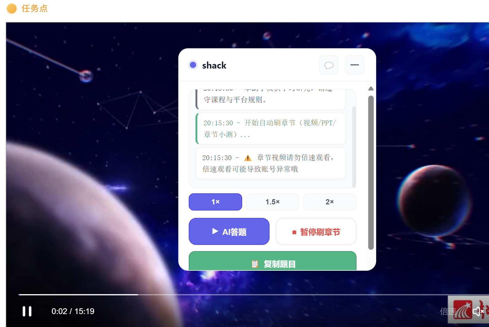
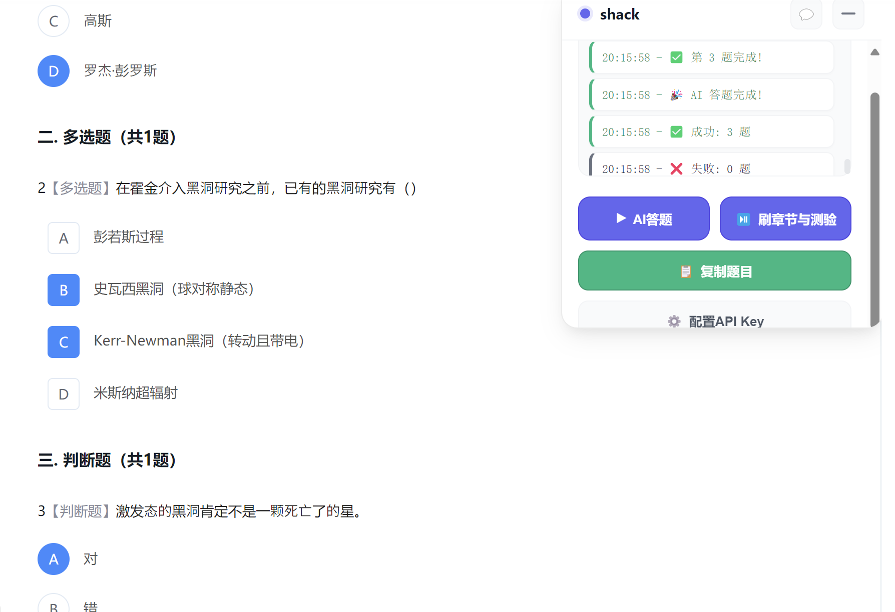
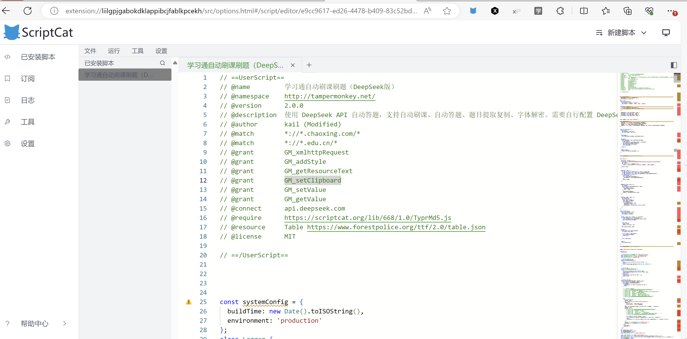
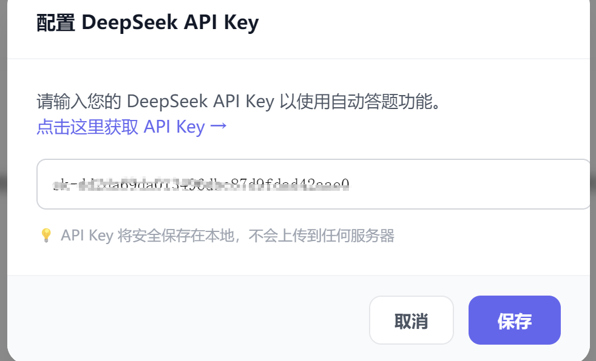
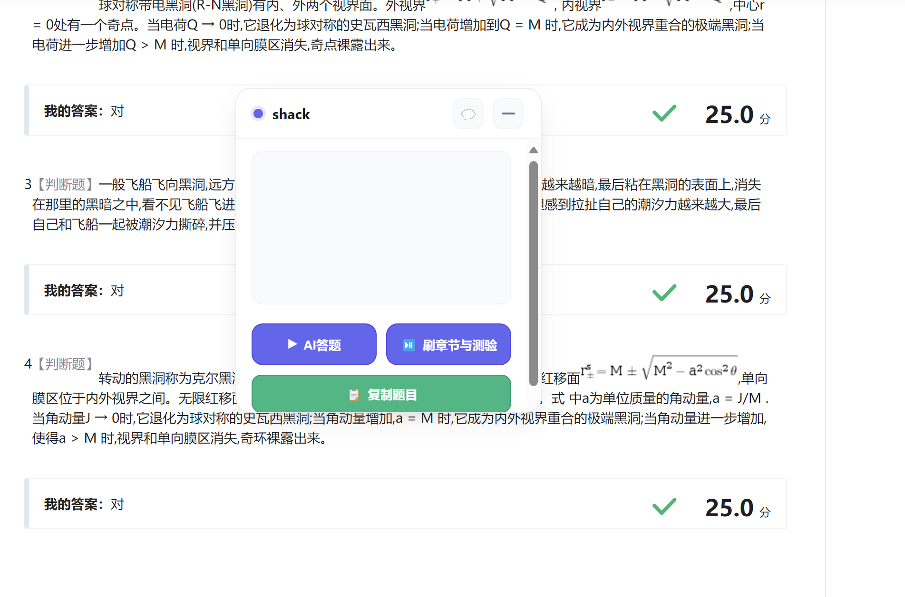
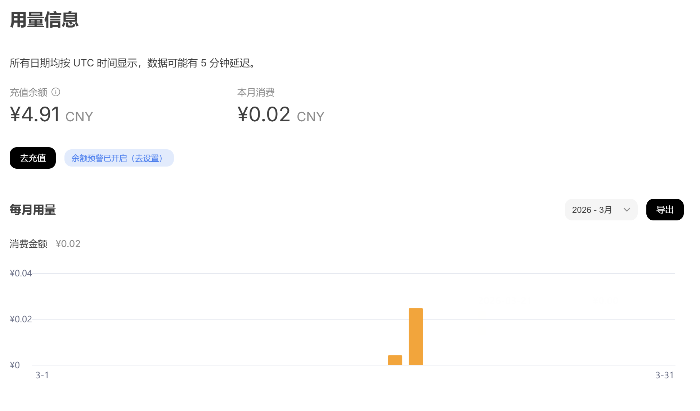

# 超星学习通助手 (CXHelper)

一个免费的开源超星学习通(学习通)自动刷题刷课油猴脚本，基于 DeepSeek AI API 实现智能答题。

> ⚠️ **本产品仅供学习研究使用，请勿进行商业用途，否则后果自负**

## 功能特点

- 🤖 **AI 智能答题** - 调用 DeepSeek API 智能分析题目并给出答案
- 📺 **自动刷课** - 自动观看视频、PPT，自动跳过无关内容
- 📝 **批量答题** - 支持章节测验答题
- 📋 **题目提取** - 支持一键提取题目内容到剪贴板
- 🔐 **字体解密** - 自动解密超星加密字体，完整显示题目

### 以下是部分刷题以及相关界面

## 注意事项

1. **api调用**：此项目会调用deepseek api,请执行配置密钥
2. **学习目的**：本脚本仅辅助学习，请合理使用，切勿完全依赖
3. **隐私说明**：脚本运行在本地浏览器，不会窃取您的任何资料信息

## 插一嘴

  api花费是非常少的,一个课程我猜2毛钱就能把所有题刷完,哈哈,别人刷课的利润为 10 /0.2 = 50,至少五十倍的利润哈哈(不保证题目全对哦),我测试了大概有五十道题目,才花两分钱!!!

